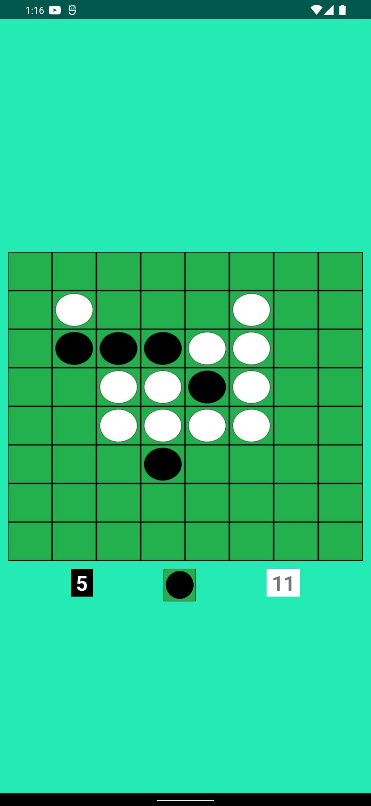

<div align = "center">

<h1><a href="https://2kabhishek.github.io/Kothello">Kothello</a></h1>

<a href="https://github.com/2KAbhishek/Kothello/blob/main/LICENSE">
 </a>

<a href="https://github.com/2KAbhishek/Kothello/graphs/contributors">
 </a>

<a href="https://github.com/2KAbhishek/Kothello/stargazers">
</a>

<a href="https://github.com/2KAbhishek/Kothello/network/members">
 </a>

<a href="https://github.com/2KAbhishek/Kothello/watchers">
 </a>

<a href="https://github.com/2KAbhishek/Kothello/pulse">
 </a>

<h3>Play Othello Anywhere ⚪📱</h3>

<figure>
  
  <br/>
  <figcaption>Kothello screenshot</figcaption>
</figure>

</div>

## What is this

Kothello is an implementation of the Othello game.

> The game is written in Java not Kotlin :p

## Inspiration

Was playing Othello with a friend and decided to write my own implementation.

## Prerequisites

Before you begin, ensure you have met the following requirements:

- You have installed the latest version of `Android Studio`.

## Getting Kothello

To install Kothello, follow these steps:

```bash
git clone https://github.com/2kabhishek/Kothello
cd Kothello
```

## How it was built

Kothello was built using `Android Studio` and `Java`.

## Challenges faced

Implementing the game logic was a challenge.

## What I learned

- Learned about different ways to use resources in Android.
- Enjoyed implementing the game logic, using board and tiles.
- Updating the game board on user interaction was fun.

## What's next

Maybe add a AI player to the game.

Hit the ⭐ button if you found this useful.

## More Info

<div align="center">

<a href="https://github.com/2KAbhishek/Kothello">Source</a> | <a href="https://2kabhishek.github.io/Kothello">Website</a>

</div>
